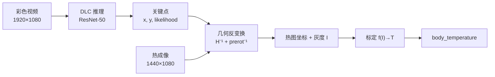

# 小鼠体温实验流水线 — 算法思想与模型结构报告

本文档汇总本仓库 **DLC 姿态估计**、**双相机图像对齐**、**温度计算** 三段的算法思路、数学模型与数据结构，便于实验报告、答辩或交接阅读。

相关操作手册：

- [DeepLabCut 工作流](deeplabcut.md)
- [Color / Thermal 对齐](alignment.md)
- [温度计算与汇总](thermometry.md)
- [性能与延时估算](performance.md)

---

## 1. 总体架构

### 1.1 数据流

两台相机同步采集：**彩色俯视**（1920×1080，纹理清晰，用于定位）与 **热成像**（采样时为了避免压缩影响扩展为1440×1080，用于测温）。小鼠在彩色视频上追踪，几何映射到热图后采样灰度，再经标定换算为 °C。



### 1.2 设计原则

| 原则 | 说明 |
|------|------|
| 定位与测温分离 | 深度学习只在彩色域做；热图只做几何映射 + 标定换算 |
| 几何一次标定 | 相机固定时，`transform.json` 全实验共用 |
| 温度需 anchor | 8-bit 伪彩 mp4 无绝对辐射信息，至少 2 个 `(I, T°C)` 点拟合曲线 |
| 可复现、可解释 | 各阶段为 OpenCV / numpy / pandas，无黑盒端到端测温 |

### 1.3 目录与模块对应

```
temperature/
├── dlc_workflow.py, dlc_config.py     # DLC 工程与训练/推理 CLI
├── alignment/                         # 双相机对齐 + DLC→热图
│   ├── transforms.py                  # 几何变换核心
│   ├── transform.json                 # 标定结果（运行时依赖）
│   └── dlc.py                         # 坐标转换 / 强度采样
└── thermometry/                       # intensity → °C
    ├── calibration.py                 # 线性 / 分段线性标定
    └── compute.py                     # 逐帧换算与聚合
```

---

## 2. DLC 姿态估计

### 2.1 任务定义

- **场景**：单只小鼠、俯视彩色视频（`data/color/top*.mp4`）
- **输出**：逐帧 3 个关键点坐标及置信度
- **关键点**（动物自身左右，非画面左右）：

| 名称 | 含义 |
|------|------|
| `left_eye` | 左眼 |
| `right_eye` | 右眼 |
| `tail_base` | 尾根 |

可选第 4 点 `tail_middle`：在 `dlc_config.py` 中设 `INCLUDE_TAIL_MIDDLE = True` 后同步到 `config.yaml`。

- **引擎**：DeepLabCut 3.0（PyTorch），默认骨干 **ResNet-50 (GroupNorm)**

### 2.2 算法思想

| 阶段 | 方法 |
|------|------|
| 训练数据 | `extract` 用 k-means 从视频抽代表性帧；`label-simple` 人工标点 → `CollectedData_lab.csv` |
| 学习目标 | 输入 RGB 帧 → 预测每个关键点的 **热力图（heatmap）** 与 **位置细化偏移（locref）** |
| 推理 | 全视频逐帧前向，输出 `(x, y, likelihood)`；`pcutoff` 仅影响可视化阈值 |
| 与下游关系 | 坐标在 **彩色像素系**；进入热图须经 `alignment` 反映射 |

属于经典的 **单动物、固定 bodypart 数、top-down 关键点检测**，不是端到端测温网络。

### 2.3 模型结构

配置来源：`dlc_project/.../dlc-models-pytorch/.../train/pytorch_config.yaml`（详见 [performance.md](performance.md)）。

```
输入: BGR 1920×1080
        │
        ▼
┌─────────────────────────────────────────┐
│  Backbone: ResNet-50 (GroupNorm)        │
│  output_stride = 16（dilation 降采样）   │
│  特征图分辨率 ≈ 输入的 1/16              │
└─────────────────────────────────────────┘
        │ 2048 通道特征
        ├────────────────────┬────────────────────┐
        ▼                    ▼                    │
  Heatmap Head           Locref Head               │
  ConvTranspose2d        ConvTranspose2d           │
  2048 → 3, stride=2     2048 → 6, stride=2       │
  （每点 1 通道热图）      （每点 x,y 亚像素偏移）   │
        │                    │                    │
        └──────────┬─────────┘                    │
                   ▼                              │
        3 × (x, y, likelihood)                   │
```

| 组件 | 作用 |
|------|------|
| **Heatmap head** | 每 bodypart 一张高斯峰热力图，峰值位置为粗定位 |
| **Locref head** | 在热力图邻域回归亚像素偏移，提高定位精度 |
| **stride=16** | 相对标准 ResNet-50（stride=32）特征图更大，利于小目标，FLOPs 更高 |

**规模（本仓库实测，1920×1080）**：

| 指标 | 数值 |
|------|------|
| 参数量 | ≈ **23.67 M**（backbone ≈ 23.51 M + head ≈ 0.17 M） |
| 计算量 | ≈ **262 GMACs / 帧**（≈ 524 GFLOPs） |
| 延时（RTX 4070 Laptop, FP32） | ≈ **96 ms/帧**（≈ 10.4 FPS） |

### 2.4 局限与改进方向

- 遮挡、运动模糊、光照变化 → `likelihood` 下降，需补标难帧并重训
- 俯视 3 点足以描述头尾位置；若需躯干细节可启用 `tail_middle`
- 推理耗时 dominated by backbone；批量/TensorRT 等未在本仓库默认启用

---

## 3. 双相机图像对齐

### 3.1 问题定义

将热成像（1440×1080）的像素坐标与彩色（1920×1080）建立对应关系，使得：

1. **可视化**：热图 warp 到彩色系后可叠加检查对齐质量
2. **测点映射**：DLC 在彩色上的 `(xc, yc)` 可反算热图上的 `(xt, yt)` 以采样温度

两台相机 **安装固定、夹角小**，几何关系与帧内小鼠位置无关，故 **标定一次、全视频复用**（`alignment/transform.json`）。

### 3.2 算法选型历程

| 尝试方案 | 结果 |
|----------|------|
| ORB + RANSAC、ECC、相位相关、模板匹配 | 彩色与热成像跨模态差异大，网格背景缺乏判别特征，失败 |
| 纯 4 点单应 + 滑块 | 90° 朝向差与缩放/平移耦合，调参困难 |
| **当前方案** | `prerot` 处理大角度旋转 + `M` 处理缩放/平移/微旋转 |

### 3.3 几何模型

变换为 **两步复合**（实现：`alignment/transforms.py`）：

```
热图像素 (xt, yt)     源尺寸 1440×1080
    │
    │ ① prerot ∈ {0°, 90°, 180°, 270°}
    ▼
旋转后坐标 (xr, yr)
    │
    │ ② 矩阵 M
    │    mode = "affine"  → 2×3，cv2.warpAffine / cv2.transform
    │    mode = "homography" → 3×3，cv2.warpPerspective / perspectiveTransform
    ▼
彩色像素 (xc, yc)     目标尺寸 1920×1080
```

**整帧正向 warp**（预览、导出叠加视频）：

```
aligned_thermal = warp( prerot(thermal), M )   # 映射到彩色分辨率
overlay = (1 - α) · color + α · aligned_thermal
```

**单点反向映射**（DLC → 热图，用于 `alignment.dlc`）：

```
(xc, yc)  --[H⁻¹ 或 M⁻¹]-->  (xr, yr)  --[inv_prerot]-->  (xt, yt)
```

函数：`map_color_point_to_thermal` / `map_thermal_point_to_color`。

### 3.4 标定方法

| 方式 | 入口 | 说明 |
|------|------|------|
| **滑块微调（推荐）** | `python -m alignment.tune` | 6 参数：`prerot`、`scale_x/y`、`tx/ty`、小角度 `deg`；实时叠加预览；`s` 写入 JSON |
| **点击对应点** | `python -m alignment.calibrate` | 热图/彩色各标 3 对（仿射）或 ≥4 对（单应 + RANSAC） |
| **重置** | `python -m alignment.align init` | 单位变换，仅变换文件损坏时使用 |

`transform.json` 示例字段：

| 字段 | 含义 |
|------|------|
| `mode` | `"homography"` 或 `"affine"` |
| `prerot` | 应用 `M` 前对热图的整图旋转（度） |
| `matrix` | 3×3 或 2×3 浮点矩阵 |
| `src_size` / `dst_size` | 源/目标分辨率 |

### 3.5 DLC 与热图的衔接（`alignment.dlc`）

| 子命令 | 功能 | 核心算法 |
|--------|------|----------|
| `convert` | 彩色 DLC CSV → 热图坐标 CSV | 逐帧逐点 `map_color_point_to_thermal` |
| `sample` | 在热图视频上采样强度 | 反映射 + `BGR2GRAY` + 邻域统计 |
| `draw` | 热图视频上绘制关键点 | 反映射 + 圆点叠加 |

**强度采样（`sample`）算法**：

1. 读 thermal 帧，`cv2.cvtColor(BGR2GRAY)` → 灰度 `I ∈ [0, 255]`（**相对热度**，非 °C）
2. 将 DLC 彩色坐标反映射为 `(xt, yt)`
3. 在 `(xt, yt)` 处取 `(2r+1)²` 邻域均值（默认 `r=3` → 7×7）
4. 可选 `search_radius`：在 ±N 像素内对 `boxFilter` 均值图取 **局部最大**（缓解标点与热点错位）

输出：`*_thermal_intensity.csv`，每 bodypart 列 `<bp>_x`, `<bp>_y`, `<bp>_intensity`, `<bp>_likelihood`。

### 3.6 局限

- 相机被动或视场变化 → 需重新 `tune` / `calibrate`
- `sample` 的灰度受伪彩 LUT、H.264 量化、自动量程影响，跨日实验建议复核标定
- 点击标定路径需注意 `prerot` 与点击坐标系一致（多数情况先用 `tune` 设好 `prerot`）

---

## 4. 温度计算

### 4.1 问题定义

输入：`alignment.dlc sample` 产出的逐帧、逐 bodypart **灰度强度** `I` 及 `likelihood`。

输出：各点温度 `T_bp`（°C）及聚合列 `body_temperature`。

前提：仅有 **8-bit 伪彩 mp4**，无厂家 raw 辐射通道，故必须通过 **外部 anchor** 建立 `I → T` 映射。

### 4.2 算法思想

不做 colormap 三通道逆变换（量化与自动量程会使 BGR 偏离 LUT）。流程为：

1. **空间**：DLC + 对齐决定「在热图哪一像素测」
2. **标定**：若干已知温度时刻，用 `measure` 统计对应帧区间的 intensity 中位数，与真实温度配对为 anchor
3. **换算**：对每帧 `T_bp = f(I_bp)`，再按策略聚合为 `body_temperature`

### 4.3 标定模型结构

实现：`thermometry/calibration.py`，持久化：`thermometry/calibration.json`。

#### 4.3.1 线性模型

\[
T = a \cdot I + b
\]

- 拟合：`np.polyfit(I, T, 1)` 最小二乘
- 要求：≥ 2 个 anchor，且 intensity 不相同
- 适用：工作温区窄（如 35–40°C）、伪彩近似单调

#### 4.3.2 分段线性模型

\[
T = \mathrm{interp}(I;\; I_1..I_n,\; T_1..T_n)
\]

- 实现：`np.interp`，端点外 **截断** 到端点温度（不外推）
- 建议：4–6 个 anchor，覆盖关心温区
- 适用：IRON / Rainbow 等非线性伪彩

两种模型统一 `apply(intensity)` 接口，下游 `compute.py` 无感切换。

### 4.4 逐帧计算与聚合

实现：`thermometry/compute.py` → `apply_to_dataframe`。

对每一帧、每个 bodypart：

```
1. T_bp = calibration.apply(I_bp)
2. 若 I_bp 为 NaN，或 likelihood < p_cutoff → T_bp = NaN
3. body_temperature = aggregate( { T_bp | 有效 } )
```

| `aggregator` | 含义 | 典型用途 |
|--------------|------|----------|
| `max`（默认） | 取有效部位最高温 | 眼角/耳廓常偏热，近似「表观核心温」 |
| `mean` | 算术平均 | 各部位均较稳定时 |
| `median` | 中位数 | 抗个别 bodypart 标点漂移 |
| `quantile` | 自定义分位数 | 在稳健与保守之间折中 |

若该帧所有 bodypart 均无效，则 `body_temperature = NaN`。

### 4.5 标定工作流

```
1. thermometry measure   # 统计某段帧、某 bodypart 的 intensity 分布
2. 编辑 anchors.json     # 填入 (intensity, temperature°C) 及来源说明
3. thermometry fit       # 写入 calibration.json，打印 anchor 残差 Δ
4. thermometry apply / batch
5. thermometry summary   # 按视频段汇总 mean/median/max/p90
6. thermometry overlay   # 可选，热图视频叠加温度文字
```

**anchor 质量**：`fit` 输出中 `linear` 模式残差宜在 ±0.2°C 内；偏差大时需检查帧号对齐、非线性伪彩或混用不同视场/量程。

### 4.6 输入 / 输出数据结构

**输入** `*_thermal_intensity.csv`（宽表，索引 `frame`）：

| 列模式 | 含义 |
|--------|------|
| `<bp>_x`, `<bp>_y` | 热图坐标系下的像素位置 |
| `<bp>_intensity` | 灰度强度 0–255 |
| `<bp>_likelihood` | DLC 置信度 |

**输出** `*_temperature.csv`：

| 列 | 含义 |
|----|------|
| `<bp>_temperature` | °C；无效为 NaN |
| `<bp>_x`, `<bp>_y`, `<bp>_likelihood` | 透传（供 overlay） |
| `body_temperature` | 聚合体温 |

### 4.7 局限与系统误差来源

| 来源 | 影响 |
|------|------|
| DLC 定位误差 | 采样窗口偏离热点 |
| 对齐误差 | 反映射后像素错位 |
| 伪彩 + 自动量程 | 同日不同段 intensity 尺度可能漂移 → 需重 fit |
| `max` 聚合 | 可能比直肠温偏高 0.3–0.5°C |
| mp4 压缩 | 单像素噪声大 → 增大 `sample --radius` 或后处理时间平滑 |

若具备热相机 **raw / 辐射数据**，可按厂家公式直接得逐像素 °C，本模块可跳过；DLC 关键点仍可用于选 ROI。

---

## 5. 三模块对照总表

| 模块 | 类型 | 核心数学 / 结构 | 是否深度学习 | 主要配置文件 |
|------|------|-----------------|--------------|--------------|
| DLC | 关键点检测 | ResNet-50 + Heatmap/Locref | 是 | `dlc_config.py`, `config.yaml` |
| 对齐 | 经典几何 | prerot + 仿射/单应 | 否 | `alignment/transform.json` |
| 测温 | 标定回归 | 线性或分段线性 + 聚合 | 否 | `thermometry/calibration.json`, `anchors.json` |

---
